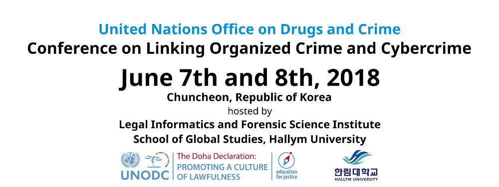

**[Registration is now open!](https://docs.google.com/forms/d/e/1FAIpQLSfBJN7sDZD0UoHxs7N06fIFm_LDOYAWwNUXdz5G3u-0ZdwQtg/viewform?usp=sf_link)**

</img>

Linking Organized Crime and Cybercrime 2018 in Chuncheon, South Korea is dedicated to understanding the way organized criminal groups are using technology to facilitate traditional crime, and conduct new types of crime. The goal of LOCC 2018 is to produce novel insights into the linkages between organized and cyber crime. Organized criminal groups have increasingly adopted technology to commit offences, and new types of crime are also made possible through new technologies. This conference is concerned with the way that organized crime, including trafficking in persons and smuggling of migrants, is enabled or supported by technology.

LOCC 2018 is generously hosted by [Hallym University](https://cis.hallym.ac.kr) and  sponsored by the [United Nations Office on Drugs and Crime](https://unodc.org) (UNODC) under its Education for Justice (E4J) initiative. The E4J forms part of the Global Programme for the Implementation of the Doha Declaration,  adopted by the Thirteenth United Nations Congress on Crime Prevention and Criminal Justice in 2015, which recognizes the fundamental role of universal education for children and youth as key to the prevention of crime, terrorism and corruption, as well as sustainable development.

There are **no submission, publication or registration fees**. Further, accepted papers
will be provided with flights and a per diem scholarship.

## Agenda
<iframe src="https://docs.google.com/spreadsheets/d/e/2PACX-1vSotOQNa5fZ3-jntiwyoTDU9uRwddsI4PiOE_9z-8cY690w4gm4vcSM35VIsqB8w6t6w7PGM7eUh0o6/pubhtml?gid=0&amp;single=true&amp;widget=true&amp;headers=false"></iframe>

## Dates
* Call for Papers: January 15, 2018
* Submissions Due: March 30, 2018 (AoE)
* Author Notification: April 30, 2018
* Conference: June 7-8, 2018
